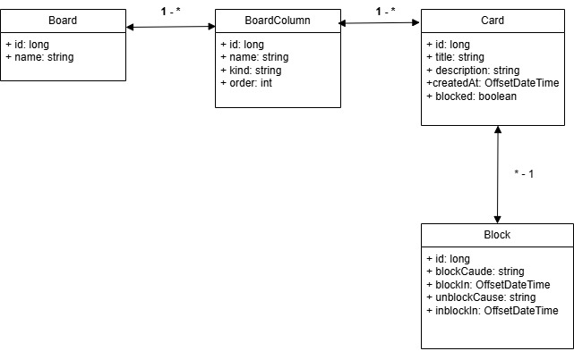

# 🚀 Desafio de Projeto - Decola Teck 2025

## Board de Tarefas com Java
### Projeto desenvolvido desde o planejamento e estruturação até a implementação de funcionalidades como gerenciamento de dados e integração entre camadas, seguindo boas práticas de programação.

### 🛠 Ferramentas
* 'liquibase' como ferramenta para controle das alterações no shema do banco de dados.
* 'lombok' para geração de código automático atraves de anotaçoes.
  
| Anotação              | O que faz                                                     |
| --------------------- | ------------------------------------------------------------- |
| `@Data`               | Gera getters, setters, `equals()`, `hashCode()`, `toString()` |                            |
| `@AllArgsConstructor` | Gera construtor com todos os campos                           |

## 🛣️ Roadmap

- [x] CRUD de tarefas e quadros no terminal
- [x] Armazenamento local em banco (Mysql)
- [ ] Migrar back-end para Spring Boot REST
- [ ] Implementar banco na nuvem (PostgreSQL)
- [ ] Criar interface web (Angular)
- [ ] Autenticação de usuários (login/cadastro - Spring Secutity)
- [ ] Deploy na nuvem (Azure + Vercel)
- [ ] Dashboard com estatísticas (Chat.js)
- [ ] Testes unitários e de integração (JUnit + Mockito) 
- [ ] Documentação da API com Swagger

## 🔗 Links

